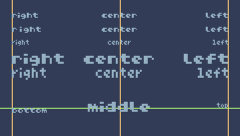

# Print Alignment Function

A simple created function to align texts according to their position on the screen.

[Click here](https://tic80.com/play?cart=2594) to try the cartridge on the TIC-80 site.

## How to use

The function documentation is on the code.

See the README to know how to download the cartridge or to access it on the web.
