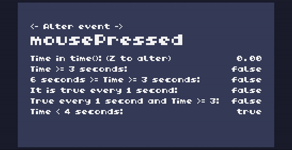

# Timer

A function that creates timers for any event in execution time
A timer can return the time in milliseconds or ticks.
It also can check if the time is less or more than a specific value and detect time frequencies.

[Click here](https://tic80.com/play?cart=2712) to try the cartridge on the TIC-80 site.

## How to use

The function documentation is on the code.

See the README to know how to download the cartridge or to access it on the web.
