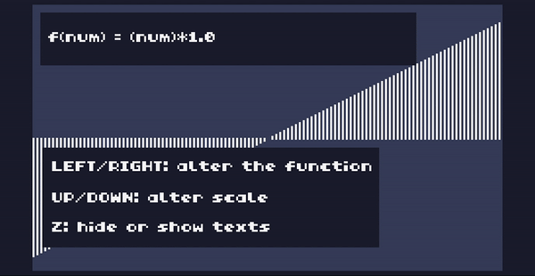

# getSequence Function

This little function generates numeric arrays from math functions, like f(num) = num + 1 and f(num) = num*num.

[Click here](https://tic80.com/play?cart=2761) to try the cartridge on the TIC-80 site.

## How to use

The function documentation is on the code.

See the README to know how to download the cartridge or to access it on the web.
